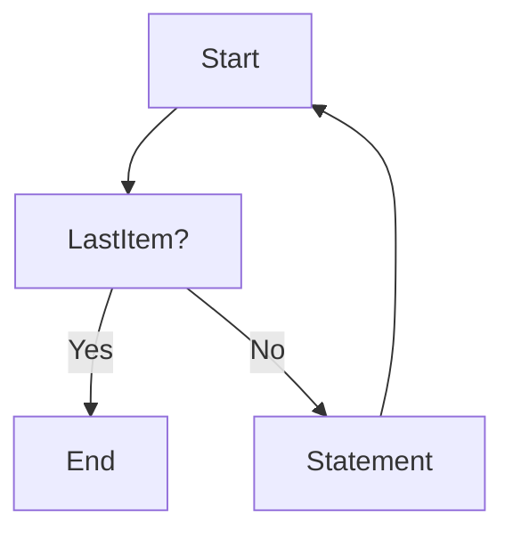
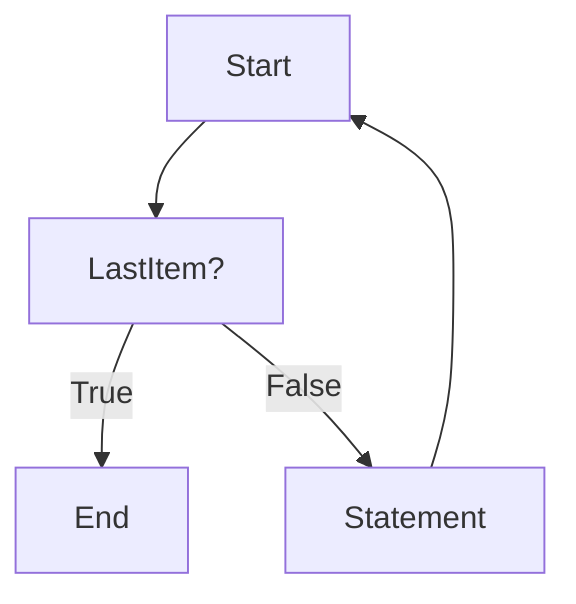

## Concept of Loops
Let us understand the concept of loops with a real-life example.
Suppose your instructor tells you to run and take 5 rounds of the playground to warm up.
Before you start running, you fix a starting point. 
On reaching the starting point again, you complete one round.
You continue this process until you have completed 5 rounds. This is a loop.
You start from a point, run a certain distance, and then come back to the starting point.
You repeat this process until you have completed 5 rounds.

### Flow chart to understand the concept of loops

#### For loop

```py
# Python code to understand the concept of loops
for i in range(5):
    print(i)
```

#### While loop

```py
while i < 5:
    print(i)
    i += 1
```
